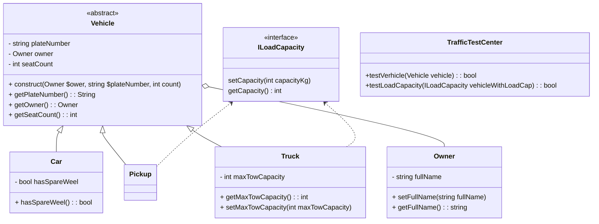

# Exercise for a Small OOP App (Car Shop)

```mermaid
 classDiagram
    
      Vehicle <|-- Car
      Vehicle <|-- Pickup
      Vehicle <|-- Truck
      Vehicle o-- Owner
      ILoadCapacity <.. Truck
      ILoadCapacity <.. Pickup
      
      class Vehicle {
          <<abstract>>
          - string plateNumber
          - Owner owner
          - int seatCount 
          
          + construct(Owner $ower, string $plateNumber, int count)
          + getPlateNumber(): String
          + getOwner(): Owner
          + getSeatCount(): int
      }
      
      class Car {
          - bool hasSpareWeel
          + hasSpareWeel(): bool
      }
      
      class Pickup {
          
      }
      
      class Truck {
        - int maxTowCapacity
        + getMaxTowCapacity(): int
        + setMaxTowCapacity(int maxTowCapacity)
      }
      
      class Owner {
        - string fullName 
        
        + setFullName(string fullName)
        + getFullName(): string
      }
      
      class ILoadCapacity {
        <<interface>>
        setCapacity(int capacityKg)
        getCapacity() int
      }
      
      class TrafficTestCenter {
        +testVerhicle(Vehicle vehicle): bool
        +testLoadCapacity(ILoadCapacity vehicleWithLoadCap): bool
      }

```
